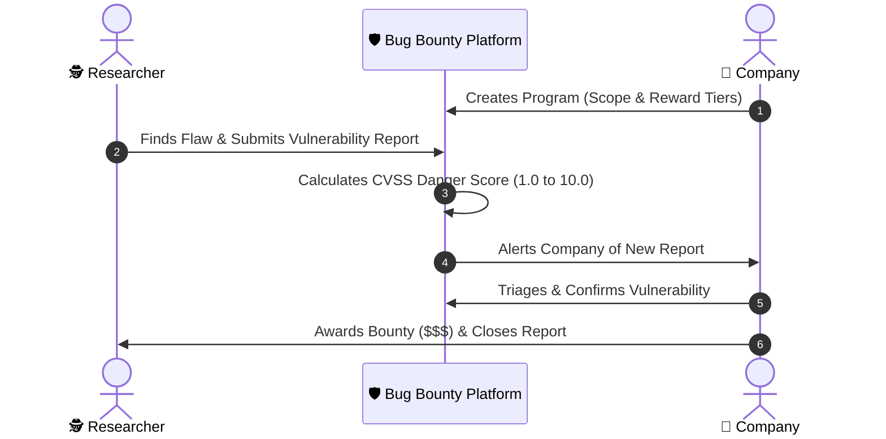

# 🚀 Beginner's Guide: Bug Bounty Platform

Welcome! If you are opening this project for the first time, this document is your friendly, plain-English roadmap to understanding **what** this project is, **how** it works under the hood, and **how** to run it—even if you've never built a cybersecurity system before.

---

## 🧭 1. What is this Project?

Imagine a company builds an online bank or shopping website. They want to make sure real cyber criminals (black-hat hackers) can't break in and steal customer data.

Instead of waiting to get hacked, companies invite friendly security researchers (ethical/white-hat hackers) to legally hunt for security holes. 
* When a researcher finds a vulnerability, they write a confidential report.
* The company reviews the report, fixes the flaw, and rewards the researcher with cash—a **Bounty 🪙**.

**This project is the complete platform that manages that entire process**—just like commercial platforms such as [HackerOne](https://www.hackerone.com/) or [Bugcrowd](https://www.bugcrowd.com/).

---

## 👥 2. The Three User Roles

Everyone who logs into the platform has one of three distinct roles:

| Role | Badge | What They Do |
| :--- | :---: | :--- |
| **Security Researcher** | 🕵️‍♂️ | Explores company programs within allowed scope, submits bug reports, tracks triage status, and receives payout rewards. |
| **Company Manager** | 🏢 | Creates bug bounty programs, sets reward tiers (e.g. $100 for Low, $2,000 for Critical), reviews incoming reports, and awards bounties. |
| **Platform Admin** | 👑 | The referee and platform guardian. Manages all users, resolves disputed reports, oversees system audit logs, and configures platform settings. |

---

## 🔄 3. How the Workflow Operates



---

## 🏗️ 4. The Architecture (In Plain English)

The project is split into four cooperating layers:

```
┌──────────────────────────────────────────────────────────┐
│                   1. THE FRONTEND                        │
│     React 19 + TypeScript + Vite (Port 8420)             │
│   (Sleek dashboard, report forms, charts, payouts)       │
└──────────────────────────┬───────────────────────────────┘
                           │ HTTP REST API
┌──────────────────────────▼───────────────────────────────┐
│                   2. THE BACKEND                         │
│             FastAPI + Python 3.12+ / 3.14                │
│ (CVSS calculator, RBAC logic, business rules, repos)     │
└──────────────┬────────────────────────────┬──────────────┘
               │ Database Queries           │ Ephemeral State / Cache
┌──────────────▼─────────────┐ ┌────────────▼──────────────┐
│        3. DATABASE         │ │      4. MEMORY CACHE      │
│       PostgreSQL 18        │ │          Redis 7          │
│ (User data, reports, logs) │ │ (Rate limiting & sessions)│
└────────────────────────────┘ └───────────────────────────┘
```

1. **Frontend ([frontend/](file:///d:/CYBERSECURITY%20PROJECTS/BUG%20BOUNTY%20PLATFORM/frontend)):** The interactive web app you see in your browser. Built using modern React 19, TypeScript, and Vite.
2. **Backend ([backend/](file:///d:/CYBERSECURITY%20PROJECTS/BUG%20BOUNTY%20PLATFORM/backend)):** The brain of the platform. Built with FastAPI in Python, organized using the **Repository Pattern** so data queries and business rules remain clean and isolated.
3. **Database (PostgreSQL 18):** The permanent vault storing accounts, program scopes, and submitted reports.
4. **Cache & Guard (Redis 7):** The ultra-fast in-memory store used for rate limiting (preventing spam/brute-force attacks) and tracking active sessions.

---

## 🛡️ 5. Key Security Features Simplified

* 🧮 **CVSS Scoring:** The platform automatically calculates the **Common Vulnerability Scoring System** rating (0.0 to 10.0) based on metrics like how easy the flaw is to exploit and what damage it could cause.
* 🔐 **Argon2id Passwords:** Uses the world-standard memory-hard hashing algorithm to ensure passwords cannot be cracked by high-speed GPUs.
* 🎫 **JWT Wristbands + Instant Revocation:** Users receive a short-lived token to browse the app. If a user clicks "Log out of all devices", a **token version counter** increments, instantly invalidating old tokens across all devices.
* 🚦 **Bouncer at the Door (Rate Limiting):** Prevents automated bots from flooding login or submission endpoints.

---

## 📂 6. Tour of the Project Folders

```text
BUG BOUNTY PLATFORM/
├── frontend/             # React 19 web interface (UI pages, components, CSS)
│   └── src/              # Dashboard, auth forms, report submission UI
├── backend/              # FastAPI Python server
│   ├── src/app/          # Core API routes, database models, business logic
│   └── tests/            # Automated backend security & functional tests
├── infra/                # Dockerfiles and Nginx web server configurations
├── learn/                # Deep-dive cybersecurity learning guides:
│   ├── ARCHITECTURE.md   # Complete system architecture breakdown
│   ├── DATABASE.md       # Database schemas, tables, and relationships
│   ├── GETTING-STARTED.md# Step-by-step tutorial to build this from scratch
│   ├── PATTERNS.md       # Design patterns (Repository, Service Layer)
│   └── SECURITY.md       # Defensive programming & threat models
├── compose.yml           # Production Docker multi-container setup
├── dev.compose.yml       # Local development Docker setup with live-reload
├── justfile              # Short commands for running, testing, and linting
├── README.md             # High-level technical overview
└── START-HERE.md         # This beginner guide!
```

---

## ⚡ 7. How to Run the Platform

### Single Command (Recommended)
Once **Docker Desktop** is open and running on your computer, run:

```bash
docker compose up -d
```
*(or simply run `just start`)*

Then open your browser and go to:
👉 **`http://localhost:8420`**

### Handy Commands (via `just`)
Because you have [`just`](file:///d:/CYBERSECURITY%20PROJECTS/BUG%20BOUNTY%20PLATFORM/justfile) installed, you can use these shortcuts in your terminal:

* `just start` — Starts all containers in the background.
* `just stop` — Shuts down the platform containers.
* `just logs` — Views live logs from all services.
* `just test` — Runs the backend test suite.
* `just --list` — Displays all available helper commands.

---

## 🏛️ 8. Architecture Deep Dive

> *This section breaks down [learn/ARCHITECTURE.md](file:///d:/CYBERSECURITY%20PROJECTS/BUG%20BOUNTY%20PLATFORM/learn/ARCHITECTURE.md) into digestible pieces.*

### The Big Picture: A Modular Monolith

This platform is not a sprawling microservices system with dozens of separately deployed services. It is a **modular monolith**—a single, well-organized application where each domain (users, programs, reports, auth) lives in its own tidy folder but runs together as one unit. This is a deliberate trade-off: you get all the simplicity of deploying and debugging a single app, with clean internal boundaries that could be split into microservices later if scale ever demanded it. A single database also means you get full **ACID transactions** (all-or-nothing writes) across every entity, which is critical for a financial platform that handles bounty payouts.

When a request arrives from a user's browser, it first hits **Nginx**, a reverse proxy that serves the pre-built React frontend as static files and forwards any `/api/*` requests to the FastAPI backend. Nginx also handles gzip compression (smaller payloads), security headers, and would terminate SSL/TLS in production. Behind Nginx sits the Python backend, which talks to two backing stores: **PostgreSQL** for permanent data and **Redis** for ephemeral, speed-critical data like rate-limit counters and session lookups.

---

### Backend: The Four-Layer Cake

The backend code is organized into four strict layers, each with a single responsibility. A request flows downward through them like water through a filtration system—and no layer is allowed to skip ahead or reach backward.

```
    HTTP Request arrives
          │
          ▼
   ┌─────────────┐
   │   ROUTES    │  Receives HTTP, validates input shapes, returns HTTP responses.
   └──────┬──────┘  Think of this as the receptionist: it checks your form
          │         is filled out correctly before passing it along.
          ▼
   ┌─────────────┐
   │  SERVICES   │  Contains the actual business rules. "Is this user allowed
   └──────┬──────┘  to triage this report? Does the password match? Calculate
          │         the CVSS score." This is the brain that makes decisions.
          ▼
   ┌─────────────┐
   │ REPOSITORIES│  Talks to the database. Knows how to SELECT, INSERT,
   └──────┬──────┘  UPDATE, and DELETE rows—but has zero knowledge of
          │         business rules. It is a librarian: it fetches and files
          ▼         books, but never reads them.
   ┌─────────────┐
   │   MODELS    │  Pure data blueprints. Each model maps a Python class
   └─────────────┘  to a database table (e.g., the User class = the "users"
                    table). No logic here, just column definitions.
```

**Why bother with four layers instead of putting everything in one file?** Three practical reasons:

1. **Swappability.** If the team decided tomorrow to replace PostgreSQL with a different database, only the Repository layer changes. Routes, Services, and Models remain untouched.
2. **Testability.** You can test business logic (Services) by giving it a fake Repository, without needing a real database running. Each layer can be tested in isolation.
3. **Readability.** When a new developer opens the codebase, the file structure tells them exactly where to look. Need to change how login works? Open `auth/service.py`. Need to change what columns exist on the user table? Open `user/models.py`.

Each domain module (user, program, report, auth) follows the same internal folder structure:

```
backend/src/app/user/
├── models.py        ← Database table blueprint
├── repository.py    ← Database queries (CRUD)
├── service.py       ← Business rules
├── routes.py        ← HTTP endpoint handlers
├── schemas.py       ← Request/response data shapes (Pydantic)
└── exceptions.py    ← Domain-specific errors
```

This pattern is called **Domain-Driven Design (DDD)**—group code by what business concept it belongs to, not by what technical layer it sits in.

---

### Frontend: Two Brains Working Together

The React frontend has a nuanced approach to managing data. Instead of one giant state container (the old-school Redux way), it uses **two specialized libraries**, each handling a different kind of state:

| What kind of data? | Managed by | Example |
| :--- | :--- | :--- |
| **Server state** — data that lives on the backend and needs to be fetched, cached, and kept fresh | **TanStack Query** | List of programs, user profile, report details |
| **Client state** — data that only exists in the browser and has nothing to do with the API | **Zustand** | Is the sidebar open or closed? Which modal is visible? Auth tokens stored in localStorage |

TanStack Query is powerful because it handles the hard parts of server data automatically: it caches responses so repeated page visits are instant, it refetches stale data in the background when you return to a tab, and it deduplicates simultaneous requests for the same resource. Zustand, on the other hand, is intentionally minimal—it gives you a simple hook-based store without the boilerplate overhead of Redux (no actions, reducers, or dispatchers).

The frontend also uses **file-based routing** via React Router 7. The folder structure inside `routes/` directly mirrors the URL paths: a file at `routes/company/programs/page.tsx` automatically becomes the `/company/programs` URL, and Vite lazy-loads each route so users only download the JavaScript they actually need.

---

### Database Design: Smart Choices Under the Hood

Three design decisions in the database layer stand out as particularly thoughtful:

**UUID v7 as Primary Keys.** Traditional auto-incrementing IDs (1, 2, 3…) are predictable and can be enumerated by attackers to discover how many users or reports exist. Random UUIDs (v4) solve that but are terrible for database performance because their randomness scatters index entries across disk. UUID v7 is the modern sweet spot: the first 48 bits encode a millisecond-precision timestamp, making them **time-sortable** (great for indexes and `ORDER BY` queries), while the remaining bits are random (globally unique and unpredictable). The project generates these with the `uuid-utils` library.

**SafeEnum Pattern.** Standard Python enums stored in SQLAlchemy save the **name** of the enum member (e.g., `"ACTIVE"`). If a developer later renames `ACTIVE` to `RUNNING` during a refactor, every existing row in the database becomes unreadable because the stored string no longer matches any Python member. The SafeEnum pattern stores the **value** instead (e.g., `"active"`), so you can freely rename Python enum members without breaking the database.

**Soft Deletes.** When a user account or financial report is "deleted," the platform doesn't actually remove the database row. Instead, it sets a `deleted_at` timestamp. This preserves a full audit trail for compliance and allows recovery if a deletion was accidental. Truly ephemeral data (like expired session tokens) uses hard deletes since there is no reason to keep them.

---

### Security: Five Walls, Not One

Security in this platform is not a single lock on the front door—it is a series of concentric walls, each catching threats that slip past the previous one:

```
Wall 1: INPUT VALIDATION (Pydantic)
   Every incoming request is validated against strict type schemas.
   An email field must look like an email. A title must be under 255 characters.
   Malformed requests are rejected before they reach any business logic.
       │
Wall 2: AUTHENTICATION (JWT)
   Every protected endpoint checks for a valid, non-expired access token.
   Tokens live only 15 minutes. If one is stolen, the damage window is short.
       │
Wall 3: AUTHORIZATION (RBAC)
   Even with a valid token, the system checks your role.
   A Researcher cannot access Company endpoints. A Company cannot access Admin panels.
   The system also verifies resource ownership (you can only edit your own reports).
       │
Wall 4: RATE LIMITING (Redis)
   Even legitimate, authenticated users are throttled. General endpoints allow
   100 requests per minute. Sensitive endpoints like login allow only 20.
   This stops credential-stuffing attacks and automated abuse.
       │
Wall 5: SECURE STORAGE (Argon2id + Hashing)
   Even if an attacker somehow breaches the database itself, passwords are
   hashed with Argon2id (memory-hard, GPU-resistant), and refresh tokens
   are stored as SHA-256 hashes, not plaintext. Stolen data is useless.
```

The **token rotation** mechanism deserves special attention. Every time a refresh token is used to get a new access token, the old refresh token is destroyed and a brand-new one is issued. This means each refresh token is **single-use**. If an attacker steals a refresh token and tries to use it after the real user already has, the system detects the reuse through a "family ID" tracker and immediately revokes **all** tokens for that user—forcing a fresh login and locking the attacker out.

---

### Infrastructure: One Command, Four Containers

Docker Compose orchestrates four containers that together form the running platform. The [compose.yml](file:///d:/CYBERSECURITY%20PROJECTS/BUG%20BOUNTY%20PLATFORM/compose.yml) file declares the dependency chain: Nginx depends on the backend (it can't proxy to a server that doesn't exist), and the backend depends on both PostgreSQL and Redis (it can't answer queries without its data stores). Docker starts them in the correct order automatically.

Both the backend and frontend use **multi-stage Docker builds**. The backend Dockerfile has a "builder" stage that installs all Python dependencies and a "production" stage that copies only the installed packages—leaving behind compilers and build tools that would bloat the image and increase the attack surface. The frontend build is even more dramatic: the first stage uses Node.js to compile the React app into static HTML/CSS/JS files, and the second stage copies those files into a tiny Nginx image. The final frontend container has no Node.js runtime at all, shrinking it from ~500 MB to ~50 MB.

---

### Why These Technologies? The Trade-Off Reasoning

The architecture document doesn't just list technologies—it explains why each was chosen over its alternatives:

| Choice | Over | Key Reason |
| :--- | :--- | :--- |
| **FastAPI** | Flask, Django | Async-first design, automatic OpenAPI docs, native Pydantic validation |
| **PostgreSQL** | MySQL, MongoDB | Full ACID transactions, superior JSON indexing, relational integrity for financial data |
| **React 19** | Vue, Svelte | Largest ecosystem, strongest TypeScript integration, widest job-market relevance |
| **Zustand** | Redux, Context API | Far less boilerplate than Redux, better performance than Context (no unnecessary re-renders) |
| **TanStack Query** | SWR, RTK Query | Most complete feature set (pagination, optimistic updates, infinite scroll), framework-agnostic |

The overarching philosophy is: **favour correctness, security, and maintainability over raw performance.** Performance can always be optimized later with caching and indexing. A security breach or an unmaintainable codebase cannot be easily fixed after the fact.

---

> [!TIP]
> For the full 1,000+ line deep dive with code examples and ASCII diagrams, read [learn/ARCHITECTURE.md](file:///d:/CYBERSECURITY%20PROJECTS/BUG%20BOUNTY%20PLATFORM/learn/ARCHITECTURE.md) directly. Up next: the Database and Security modules!
